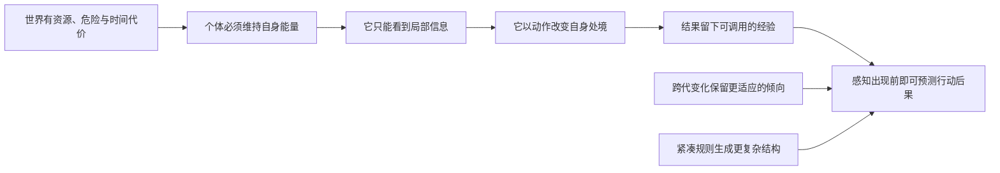

# Frog：从“活着”到“预测”的人工生命实验

Frog 不是“做一个会动的青蛙”，也不是直接追逐“人工意识”。它是一个由我主导的、以可证伪实验为核心的研究型软件项目：

> **如果一个系统有身体、有代价、有局部感知、有行动、有后果、有记忆、能把有用的结构传给下一代，那么它能否从被动反应逐步变成会预测后果的生命？**

原 `drinkjava2/frog` 提供了这个问题的灵感：生命的结构不应完全手工指定；奖惩、条件反射、遗传、发育和环境可能共同塑造行为。除此之外，当前代码、实验定义、证据标准和项目结构均为本项目重新设计。

## 先说清楚：我们究竟在验证什么

这不是一个“一次跑通就证明意识”的项目。我们把大问题拆成一串必须逐一成立、也可能逐一失败的命题：



最终我们关心的不是“青蛙看起来像不像活物”，而是三类可报告证据：

1. **自我维持**：个体是否比基线更能在有消耗的环境中存活、摄食、避险；
2. **可塑预测**：在反馈被拿掉以后，过去的好/坏后果是否仍改变当前行动；
3. **可继承适应**：跨代的结构或控制参数是否在新环境中保持优势，而不是只记住一个固定答案。

若这些都做不到，我们得到的是失败定位，而不是失败项目：可能是环境没有信息、身体没有足够行动自由、学习规则没有信用分配能力、基因编码没有表达力，或者评价指标被钻了漏洞。

## 为什么这在物理上有意义

生命不是脱离物质的“聪明”，而是一个受约束的耗散过程：能量会减少，行动有成本，环境只给局部信息，错误会带来不可逆后果。一个纯分类器即使分类正确，也不必为自己的错误付出代价；一个生命式系统必须在有限预算内持续选择。

所以我们从能量、位置、时间步和局部传感开始。它们让“偏好”变成可观察的物理后果：吃到资源延长可行动时间；碰到危险缩短未来；看不到远处时，探索与保守之间存在真实权衡。这里的“物理”不是宣称模拟真实细胞化学，而是坚持任何智能主张都必须落在资源、状态转移与可测行为上。

## 为什么这在哲学上有意义

原项目的核心直觉是：意识更像一种持续出现的组织现象，而不是某个神秘零件。我们保留这个问题，但不预先给出答案。

本项目采用更谨慎的工作定义：

> 当系统能围绕自身持续存在组织感知、记忆、预测和行动，并能在环境变化中修正这种组织时，我们才有资格讨论它是否出现了更强的生命样现象。

这不是把“存活”直接等同于意识，更不是把任何强化学习器称为有意识。它只规定一条诚实路径：先证明身体—世界闭环，再证明经验能改变未来，再证明这种改变可扩展、可继承、可泛化。任何超出行为证据的哲学结论都保持开放。

## 我会怎样走这条路

代码不按“作者历史版本”切章节，而按我实际理解一个生命必须跨过的连续能力门槛组织：

| 能力门槛 | 我在问什么 | 现在的最小实现 | 真正的难点 |
|---|---|---|---|
| 有世界 | 状态是否确定、可复现？ | `stage00_kernel` | 排除 UI、时间和随机数污染 |
| 活着有代价 | 什么是存活，什么是死亡？ | `life/world.py` + 生命周期规则 | 奖励不能泄漏答案，能量规则不能自相矛盾 |
| 身体能行动 | 行动是否真的改变未来状态？ | `life/organism.py` | 不把动作成功误解为智能 |
| 只能看局部 | 个体会不会偷看世界真值？ | `life/world.py::observe` | 部分可观测性与探索成本 |
| 经验改变决策 | 结果撤走后，过去还能否指导现在？ | `life/learning.py` | 延迟信用分配、避免“先咬后知道” |
| 适应能遗传 | 有利倾向能否跨代累积？ | `life/evolution.py` | 局部最优、种群多样性、环境课程 |
| 结构能发育 | 小基因能否生成大结构？ | `life/development.py` | 压缩率、可变异性、修复能力 |
| 模式能预测后果 | 多个线索能否在无反馈时驱动恰当行动？ | 条件反射基线与 Stage 08 | 训练/测试隔离、泛化、奖励投机 |

详细能力地图见 [能力路线与实验门槛](docs/capability-journey.md)。

## 运行当前代码

```bash
python -m venv .venv
. .venv/bin/activate
python -m pip install -e ".[dev]"
python -m pytest

# 原 018 设想的等价检查器：固定情境 random_search，不是完整演化
python -m frog search --seed 123 --max-attempts 50000 --json

# 查看真实训练快照与无反馈盲测回放
python -m frog replay --seed 123 --max-attempts 50000 --json
```

## 读项目的顺序

1. [项目论题：目标、边界与可证伪主张](docs/project-thesis.md)
2. [能力路线：每一段到底在证明什么](docs/capability-journey.md)
3. [系统架构：世界、身体、学习、遗传、发育](docs/architecture.md)
4. [底层世界与自演化框架设计](docs/tech/design-doc.md)
5. [第一阶段：有限世界与创始单细胞](docs/tech/finite-world-v1.md)
6. [证据规则：什么算成功，什么只是好看的动画](docs/research-contract.md)
7. [原项目启发与档案关系](docs/origin-and-boundary.md)
8. [历史档案导览](docs/archive-guide.md)

## 诚实边界

当前项目已有的是可运行的最小机制与测试，不是关于意识、通用智能或真实生物脑的结论。特别是 `random_search` 只是在固定三种盲测情境中筛选小网络；它必须永远按这个名字被描述。

[原始项目的叙事、图像和讨论](archive/README.md) 被保留为思想来源和反例库，而不是当前实现的说明书。