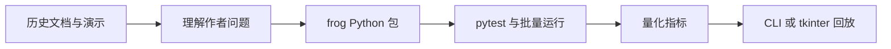

# 00：从零开始——环境、边界和第一天目标

## 这是什么项目

原项目 `Frog` 是一个长期人工生命实验：作者希望不直接写出“聪明策略”，而是提供环境、感觉、动作、奖惩、遗传和变异，让脑结构或行为通过筛选逐步形成。根目录 `README1.md`、`README2.md` 和 `README.md` 记录了从简单觅食、视觉、平衡、形状/分裂算法到条件反射的探索。

本 fork 的当前维护实现已转换为 Python。第一版保留的是 018 的可演示核心：四个二值像素、痛/甜训练反馈、阈值网络、化学调制标签、固定盲测和逐步回放。它被准确命名为 **`random_search`**，不是完整遗传演化。

我们的学习目标更具体：**用可复现的软件实验，逐个重建并检验这些小主张。**



## 先理解两类陈述

| 可以通过本项目实验验证 | 不能由当前项目直接证明 |
|---|---|
| 给定规则下，固定 seed 是否得到同一候选和同一盲测结果 | “系统有意识” |
| 某种遗传编码是否比随机连接更容易找到可行回路 | “这就是人脑的工作机制” |
| 训练后在隐藏测试模式上是否优于随机/固定策略 | “已经实现 AGI” |
| 运行轨迹、能量、权重、基因如何变化 | 单张 GIF 所代表的普适能力 |

## 开发环境

推荐在本地 VS Code 使用：

- **Python 3.11 或更高版本**；
- VS Code 扩展：Python、Python Debugger、Python Test Explorer（或官方 Python 扩展中内置测试支持）；
- 可选：Git Graph、Mermaid Preview。

终端自检：

```bash
python --version
python -m venv .venv
# Linux/macOS
. .venv/bin/activate
# Windows PowerShell: .venv\Scripts\Activate.ps1
python -m pip install -e ".[dev]"
python -m pytest
```

运行时不依赖第三方包；`pytest` 仅用于开发验证。

## 当前运行入口

```bash
python -m frog search --seed 123 --max-attempts 50000 --json
python -m frog replay --seed 123 --max-attempts 50000 --json
python -m frog gui --seed 123 --max-attempts 50000
```

- `search` 输出候选网络和固定盲测证据；
- `replay` 输出有序帧，便于在 VS Code 中分析；
- `gui` 使用标准库 tkinter；无显示环境会安全提示使用 `replay --json`。

## 如何阅读旧版本

`history/<版本>/` 仍保留 README、文档、许可证和根目录演示素材的映射，但 Java 源码、Maven 配置和启动脚本已按 fork 维护策略删除。将它们当作作者问题拆解和失败记录，而不是当前的可执行工程。

建议阅读顺序：

```text
001_first_version → 002_first_eye → 003_trap → 004_seasaw
→ 005*/006 → 010/011/012/013 → 014 → 016c/016d/017 → README 的 018 说明
```

## 今天只完成四件事

1. 在 VS Code 打开仓库根目录；
2. 创建并选择 `.venv` Python 解释器；
3. 运行 `python -m pytest` 和固定 seed 的 `search`；
4. 阅读 [原始项目地图](01-original-project-map.md) 与 [实验路线图](02-experiment-roadmap.md)。

不要急着加入“神经递质”“意识”或 GPU。首先确保每次运行都能由同一个 seed 得到同一结果。