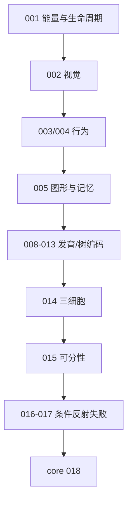

# 01：原始项目地图——先看懂历史，再开始重建

## 顶层目录

| 路径 | 原始作用 | 我们如何使用 |
|---|---|---|
| `README.md` | 2026 年的 018 目标与现状 | 读取当前作者意图；不覆盖 |
| `README1.md` | 2018—2023 的总体理念与历史 | 理解长期目标与早期实验 |
| `README2.md` | 2023—2024 的条件反射探索 | 重点学习失败与奖励投机 |
| `core/` | 曾经的 018 原型位置 | Java 源已移除；通过 `README.md`、`record/`、`result24_018.jpg` 与 Python 迁移说明追溯 |
| `history/` | 多个历史快照的文档/素材索引 | Java 源已移除；只读参考、按阶段理解 |
| `record/` | 018 中作者与 AI 的问答记录 | 追溯设计推导，不当作事实证据 |
| `other/` | 人工脑模型、入门说明、提交记录 | 理论背景与作者个人观点 |
| 根目录 `result*` | 各阶段截图/GIF | 视觉对照素材；不移动 |

> 注意：绝大多数 `result*.gif/png/jpg` 在**仓库根目录**，而不在对应 `history/` 子目录内。

## 历史—学习阶段—素材映射

| 学习主题 | 作者历史目录 | 作者当时试图验证的事 | 根目录视觉素材 | 应如何看待 |
|---|---|---|---|---|
| 生命循环起点 | `history/001_first_version` | 环境、觅食、能量、繁殖/淘汰骨架 | `result1.gif` | 先理解循环，不宣称智能 |
| 简单视觉 | `history/002_first_eye` | 少量视觉输入是否提高觅食 | `result2.gif` | 可能是感知直连，不等于识别 |
| 危险回避 | `history/003_trap` | 陷阱环境下的运动选择 | `result3.gif` | 观察环境与奖励如何定义 |
| 平衡动作 | `history/004_seasaw` | 跷跷板平衡 | `result5_seesaw.gif` | 行为任务，不等于通用运动学习 |
| 两腿/动作组合 | `history/003a_legs` | 动作序列形成 | `result7_legs.gif` | 注意任务时间尺度 |
| 图形/字母关联 | `history/005_letter_test`、`005a_letter_test`、`005a1_letter_test`、`005b_letter_test` | 字母、声音、关联记忆/全息思路 | `result6_letter.gif`、`result11_letter_test.gif`、`result12_letter_test2.png` | 重点研究泛化不足与位移问题 |
| 捕食与逃避 | `history/006_snake` | 蛇与青蛙交互 | `result8_snake.gif` | 生态演示，不自动证明复杂认知 |
| 受扰环境 | `history/007_earthquake` | 地震扰动下行为 | `result9_earthquake.gif` | 用于理解鲁棒性问题 |
| 三维/形态发育 | `history/008_frog3d_shape`、`009_wa3d_shape`、`009a_fish3d`、`009b_fish3d`、`009c_yinyang` | 三维形态、细胞分裂/阴阳规则 | `result13_frog3d.gif`、`result14_wa3d.gif`、`result15_fish3d.gif`、`result16_cell_split.gif` | 这是“压缩基因生成形态”的主线素材 |
| 树状生成 | `history/010_tree_grow` | 分裂/生长结构 | `result17_tree_grow.gif` | 对应后续发育基因型 |
| 阴阳结构与行为 | `history/011_yinyan_eatfood` | 用分裂结构参与觅食 | `result18_yinyan_eatfood.gif` | 需单独量化是否优于随机 |
| 四叉/二叉树编码 | `history/012_tree4`、`013_tree2` | 用空间树压缩编码 | `result19_tree4.png`、`depth_tree.png` | 直接关联学习阶段 05 |
| 三细胞条件反射 | `history/014_3cells` | 视、咬、忆的极简回路 | `result20_3cells1.gif`、`result20_3cells2.gif`、`result20_3cells3.gif` | 重点看“总咬/躺平”等投机行为 |
| 多输入逻辑可分性 | `history/015_testinput3` | 3 输入与单层输出的逻辑限制 | `result21_input3.png` | 这是架构限制实验，不是生命仿真 |
| 单点条件反射 | `history/016a_OneInput`、`016c_OneInput`、`016c1_OneInput` | 单视觉信号与咬/松口关联 | `result22_016c1.gif` | 对应学习阶段 06 |
| 两点失败记录 | `history/016b_twoinput_unfinish`、`016d_TwoInput_fail`、`017_TwoInput_fail` | 两输入模式及全息/分裂思路 | `result23_016d.gif` | 这是最重要的失败样本；要复盘信息泄漏 |
| 当前 018 | `core/`（不是 `history/018`） | 4 像素 + 痛/甜 + 随机网络可视化 | `result24_018.jpg` | 当前更接近随机网络搜索与固定场景筛选 |

## 建议阅读顺序

不要按目录编号机械认为能力一定递增。很多历史目录是分支、回退或明确标记为失败；它们的价值恰恰是帮助我们设计更好的验证。