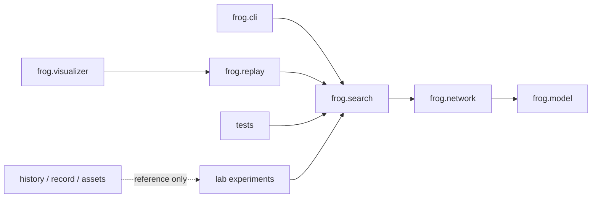

# 目标架构：Python 维护实现与历史档案分离

## 原则

原作者的仓库把多个时代的独立 Java 工程、演示素材、思路记录和当前原型放在同一树中。这对“追溯历史”很方便，但不利于用测试和数据逐步验证假设。

本 fork 已按维护者要求移除 Java/Maven 实现，改为根目录 `frog/` Python 包。历史说明、记录、素材和目录名保留为档案；新代码不依赖 GUI，`tkinter` 可视化只消费稳定的仿真状态。

## 当前目录

```text
frog/
├── README.md                         # 原作者入口 + Python 迁移说明
├── README_LEARNING.md                # 学习入口
├── MIGRATION_TO_PYTHON.md            # 迁移范围与不作声明
├── frog/                             # 当前维护的 Python 标准库实现
│   ├── model.py                      # 节点、连接、化学标签、观察与动作
│   ├── network.py                    # 阈值传播与受调制可塑性
│   ├── search.py                     # 确定性 random_search 与盲测
│   ├── replay.py                     # 逐步事件帧
│   ├── cli.py                        # search/replay/gui 命令
│   └── visualizer.py                 # 可选 tkinter 回放
├── tests/                            # pytest 行为验证
├── history/                          # 原始版本 README/文档/素材索引：只读参考
├── record/                           # 原作者与 AI 的讨论记录
├── other/                            # 原始理论/说明
├── result*.gif|png|jpg               # 原始可视化素材，保持原位置
├── docs/                             # 学习与实验协议
└── lab/                              # 后续逐阶段实验空间
    ├── experiments/                  # stage00...stage07 的可运行假设
    ├── configs/                      # 版本化实验 JSON/YAML
    └── runs/                         # gitignore：生成的结果
```

## 依赖方向



- `frog.model`、`frog.network` 不知道 tkinter、命令行和历史档案；
- `frog.search` 是显式命名的随机候选筛选器，不把自己叫作遗传演化；
- `frog.replay` 产生 JSON 安全的帧，供 CLI、UI 和未来分析工具共同使用；
- `frog.visualizer` 不能改变网络或作为成功判定器；
- `history/` 不成为 Python 的导入依赖。

## 核心对象（先少后多）

| 抽象 | 责任 | 当前状态 |
|---|---|---|
| `Observation` | 4 像素、痛觉、甜味输入 | 已实现 |
| `Node` / `Link` | 阈值节点、连接、化学标签、可塑性参数 | 已实现 |
| `Network` | 离散传播、层评估和权重夹紧 | 已实现 |
| `SearchConfig` / `SearchResult` | 固定 seed 的候选搜索与盲测证据 | 已实现 |
| `Frame` / replay | 可检查的时序事件 | 已实现 |
| `Environment` | 网格、能量、生命周期 | Stage 00/01 后续实现 |
| `Genome` / `MutationOperator` | 跨代遗传与突变 | Stage 02 后续实现 |
| `DevelopmentProgram` | 基因型生成空间节点/连接 | Stage 05 后续实现 |
| `ExperimentRunner` | 训练/验证/测试分离和 30 seed 批量实验 | Stage 07 后续实现 |

## 不做什么

当前目标不是一次性模拟真实大脑，也不预先引入 GPU、深度学习框架、数百万神经元、复杂神经递质或语言模型。更不能把固定三场景的随机搜索成功，解释成生物学机制、通用智能或意识。只有当上一阶段通过既定指标，下一阶段才增加复杂度。