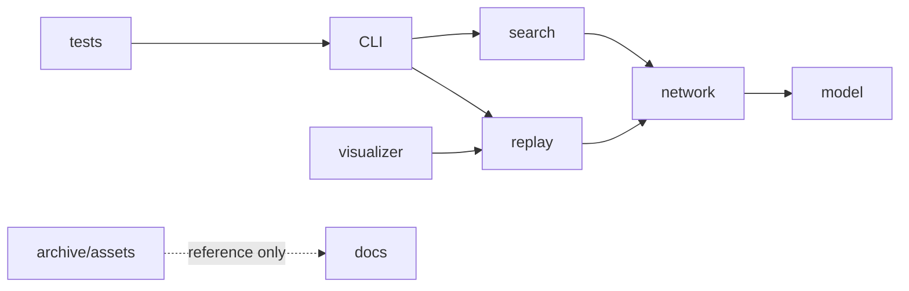

# 架构

## 分层

| 模块 | 责任 | 禁止事项 |
|---|---|---|
| `frog.model` | Observation、Action、Node、Link、Frame | 不做 I/O、UI、搜索 |
| `frog.network` | 图不变量、分层前向传播、可塑性 | 不定义实验情境 |
| `frog.search` | 候选生成、训练情境、固定盲测、SearchResult | 不做 GUI |
| `frog.replay` | 渲染已记录训练轨迹，生成无学习盲测帧 | 不重新训练候选 |
| `frog.visualizer` | tkinter 展示 | 不改变网络和评估结果 |
| `lab/` | 后续独立实验 | 不导入 archive 内容 |

## 当前关键不变量

1. 每条链接必须从较低 layer 指向较高 layer；
2. 每个源 layer 只传播一次；
3. 盲测调用 `learn=False`，且观察中无痛/甜反馈；
4. Replay 的训练帧来自 `SearchResult.training_trace`，不得重演并重新学习；
5. 每次随机性从 `SearchConfig.seed` 派生；
6. JSON 输入/输出必须可被验证，错误不允许静默吞掉。

## 后续演进

新增 Stage 00 以后，建议迁移到 `src/frog/` 布局；本次结构清理不强行引入该变更，以避免目录移动和新实验同时发生。迁移应在专门提交中由 CLI 合同测试保护。