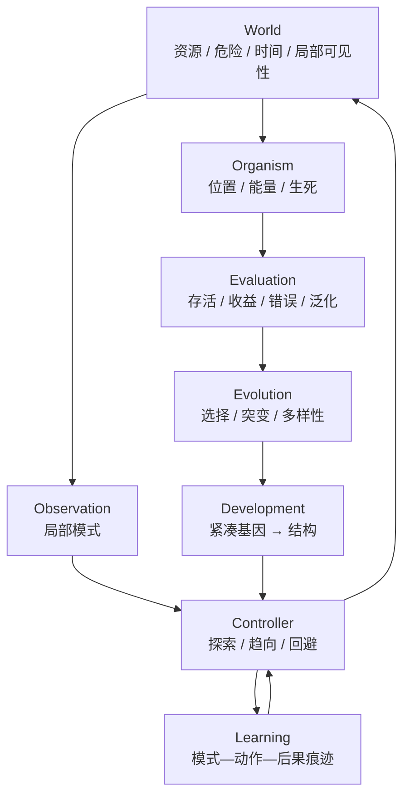

# 架构：一个生命闭环，而不是一堆演示

## 五层责任

| 层 | 现在的模块 | 责任 | 不负责什么 |
|---|---|---|---|
| 世界 | `frog.life.world` | 状态转移、局部感知、资源/危险后果 | 决定个体策略 |
| 身体 | `frog.life.organism` | 能量、位置、生死 | 偷看世界或评估自己 |
| 控制 | `frog.life.controller` | 从 Observation 输出动作 | 读取世界真值 |
| 记忆 | `frog.life.learning` | 保留模式—动作—后果证据 | 在测试期读取后果 |
| 跨代结构 | `frog.life.evolution`、`frog.life.development` | 选择、突变、紧凑结构表达 | 直接写死最终行为 |

历史等价的 `frog.search`、`frog.network` 与 `frog.replay` 保留为“018 随机搜索检查器”，不作为新生命闭环的中心架构。

## 当前工程约束

1. `World.observe()` 是世界到个体的唯一信息出口；
2. `Controller.act()` 只接收 `Observation`；
3. 学习模块的预测接口不接收即时奖励；
4. 评估模块应读取完整轨迹，不能从 GUI 状态判断；
5. 任何跨代变化都必须记录 seed、基因、适应度和环境配置；
6. 任何发育结构都必须可序列化、可重复生成、可限制资源预算。

## 接下来最重要的实现

不要继续扩展孤立的 `stageNN_*` 模块。后续代码应围绕 `frog.life` 实现设计文档中的巨大稀疏世界、异步繁殖、谱系、受约束基因/发育指令和完整 `life_loop`。详细技术设计见 [底层世界与自演化框架](tech/design-doc.md)。