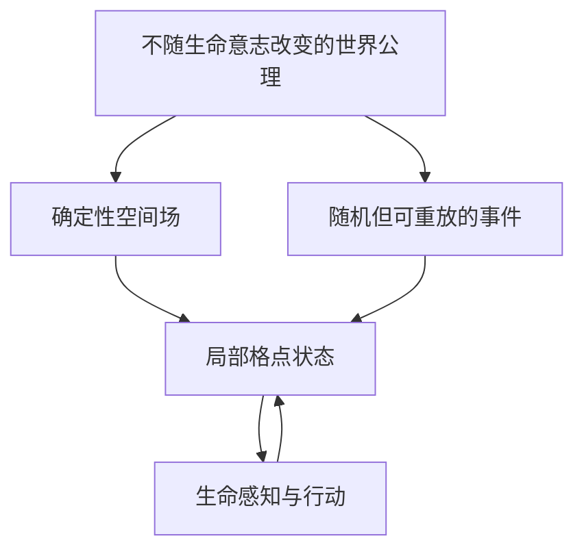
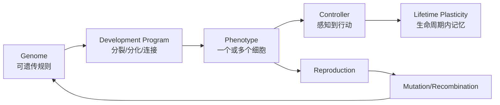

# Design Doc: 人工生命世界与自演化底层框架

## 1. Context & Scope

Frog 的核心不再是复刻某个青蛙动画，而是建立一个可长期运行的二维人工世界：世界具有稳定法则、局部随机事件、资源循环和空间尺度；其中的生命从一个像素大小的单细胞开始，必须消耗能量、感知局部、行动、繁殖，并在繁殖与发育过程中改变自身结构。我们要观察复杂行为和多细胞结构是否能在约束下逐步出现，而不是预先把“趋食”“避险”写进个体。

本设计只规定底层世界、生命编码、时间推进、繁殖、发育、可塑性和证据系统。它不预先规定最终物种，不承诺意识或 AGI，也不把一次形态变化解释为“跃迁成功”。

> 实施说明：本文是远期总体架构。第一版将世界收敛为可稠密验证的 `128 × 128` 有限环面，并只实现单细胞、资源、繁殖和遗传变异。详见 [`finite-world-v1.md`](finite-world-v1.md)。

> 研究论题见：`docs/project-thesis.md`

## 2. Goals & Non-Goals

### Goals

- **巨大逻辑世界**：提供 `8,388,608 × 8,388,608` 个逻辑格点，同时仅实例化活跃区域，避免约 70 万亿格的稠密内存开销。
- **确定性重放**：同一世界配置、根 seed 和事件日志必须产生一致状态哈希。
- **可调时间**：支持单步、倍速、暂停、回放；区分 tick、生命周期、繁殖代次和世界纪元。
- **生命自主迭代**：个体由基因组与发育程序生成，不由环境直接编排身体结构或动作策略。
- **三种变化分离**：明确区分生命周期内可塑性、繁殖时遗传变异、出生/成长时结构发育。
- **单细胞到多细胞**：允许基因控制细胞分裂、分化、粘附、连接、凋亡；多细胞不是固定升级，而是在环境中可能出现的表型。
- **生态扩张**：资源、危险、地形、气候和灾变形成既有确定法则又有随机扰动的世界。
- **证据可审计**：每次出生、突变、分裂、死亡、奖励、结构变化和谱系关系都能回放和统计。

### Non-Goals

- 不模拟真实地球的全部物理、化学与生态细节。
- 不允许生命任意改写宿主 Python 代码；“自我改造”只发生在受约束、可序列化的基因/发育/可塑参数空间。
- 不把人为规定的“到第 N 代变成双细胞”作为成功；多细胞必须由可变规则产生并经选择保留。
- 不在第一版实现神经递质全化学仿真、连续流体、真实蛋白质折叠或三维世界。
- 不用存活、繁殖或复杂形态单独证明意识。

## 3. Design

### 3.1 世界尺度

若把一个格点理解为一个约 `1.70 m` 高的人，地球直径约 `12,742 km`，两者比例约为 `7,495,294 : 1`。选择最近且便于二进制寻址的尺度：

```text
世界边长 = 2^23 = 8,388,608 cells
逻辑格点数 = 2^46 ≈ 70.37 万亿
```

这使一个单细胞相对世界边长的比例与“人相对地球直径”处于同一数量级。它不是地球表面的精确投影，只是提供足够大的尺度分离。

世界默认采用**环面边界**：越过东边进入西边，越过北边进入南边，避免生命利用人工边界。坐标使用 23 位无符号整数。世界分成 `256 × 256` 格的 chunk：

```text
每轴 chunk 数 = 8,388,608 / 256 = 32,768
逻辑 chunk 数 = 1,073,741,824
```

只实例化含生命、资源、事件或近期访问的 chunk；空白区由世界 seed 和坐标按需生成。世界规模巨大，但运行成本取决于活跃生态区，而不是逻辑面积。

### 3.2 世界的“公理”与“事件”



**公理**是稳定规则：

- 时间只向前推进；
- 能量守恒采用简化账本：世界资源、生命储能、代谢消耗和散失均有来源/去向；
- 一个格点同一时刻的实体占用有明确上限；
- 感知有半径和成本，不能读取世界真值；
- 行动、维持细胞、分裂、连接和学习都消耗能量；
- 伤害、死亡、衰老和资源再生遵守配置化规则；
- 生命无法直接修改世界公理。

**确定事件**由周期或空间场决定：昼夜、季节、资源扩散、地形、温度梯度。

**随机事件**由可重放随机流决定：局地灾害、资源爆发、疾病、辐射导致的突变率变化。随机性必须由 `(world_seed, epoch, chunk, event_kind)` 派生，不能使用散落的全局随机数。

### 3.3 时间模型

| 时间层 | 默认含义 | 可调参数 |
|---|---|---|
| `tick` | 感知—决策—行动—代谢的一次原子推进 | `ticks_per_second`、单步/暂停 |
| `cycle` | 一组昼夜/环境周期 | `ticks_per_cycle` |
| `lifetime` | 个体从出生到死亡 | 不固定，由能量、伤害和衰老决定 |
| `generation` | 谱系繁殖深度 | 非全局同步；不同谱系可重叠 |
| `epoch` | 世界统计、快照和事件调度窗口 | `ticks_per_epoch` |

仿真速度只影响墙钟播放速度，不影响逻辑 tick。第一版采用**确定性单线程事件序**作为正确性基线；并行化必须保证同 seed 的结果规则明确，否则只能声明统计等价，不能声明逐位重放。

### 3.4 一个生命由什么组成



#### Genome：可遗传信息

基因组不是 Python 代码，而是受约束指令和参数：

- 细胞分裂触发条件；
- 子细胞相对位置；
- 细胞类型/功能分化；
- 细胞粘附与通信通道；
- 传感器、执行器和内部状态单元配置；
- 控制网络节点/连接生成规则；
- 代谢、衰老、繁殖阈值；
- 可塑性强度与遗传变异率。

#### Cell：最小身体单元

每个细胞最少包含：位置、能量、类型、年龄、内部状态、膜输入/输出、邻接关系和基因引用。单细胞生命只有一个 cell；多细胞生命由共享 organism_id 的细胞图构成。

#### Organism：个体边界

个体不是固定大小对象，而是细胞图及其资源共享/控制边界。需要明确：

- 哪些细胞属于同一身体；
- 能量是否共享、如何运输；
- 感知如何汇聚；
- 动作如何协调；
- 生殖细胞如何产生后代；
- 部分细胞死亡是否导致个体死亡。

### 3.5 三种“自我改变”不能混为一谈

| 变化 | 发生时间 | 是否遗传 | 例子 |
|---|---|---|---|
| 生命周期可塑性 | 个体活着时 | 默认不遗传 | 某视觉模式与痛苦后果形成记忆 |
| 发育/重构 | 同一个体成长时 | 规则遗传，具体状态不遗传 | 能量充足后分裂出第二个运动细胞 |
| 遗传变异 | 产生后代时 | 是 | 分裂阈值、连接规则、代谢率发生突变 |

第一版不采用拉马克式“学习所得直接写回基因”。若未来实验该机制，必须作为独立可开关假设，和普通遗传对照。

### 3.6 单细胞如何可能变成多细胞

多细胞变化由以下链路产生，而不是硬编码代次：

```text
世界压力
  → 某些基因变体在特定条件下触发细胞分裂/不完全分离
  → 子细胞因粘附规则保持连接
  → 分化规则使两个细胞承担不同功能
  → 协同个体的净繁殖率高于单细胞
  → 该发育规则在种群中提高频率
```

为了让这种跃迁有可能被选择，世界必须存在**单细胞难以同时优化的任务**，例如：

- 传感与移动的空间冲突；
- 大颗粒资源需要两个相邻细胞协作处理；
- 危险环境中外层保护细胞与内层生殖细胞分工；
- 信号从一侧传入，动作必须由另一侧执行；
- 资源脉冲要求储能细胞与运动细胞分工。

如果环境对多细胞没有收益，演化不出多细胞不是框架失败，而是正确结果。

### 3.7 繁殖、死亡和谱系

繁殖为异步事件，不采用“全世界统一换代”：

1. 个体能量超过繁殖阈值；
2. 复制基因组；
3. 按配置执行点突变、参数扰动、结构插入/删除；
4. 生成后代初始细胞；
5. 记录 parent_id、genome_hash、mutation_delta；
6. 后代在局部空间开始独立生命周期。

死亡释放部分能量回世界，形成资源循环。谱系系统记录祖先、后代、寿命、繁殖数、形态复杂度和关键结构变化。

### 3.8 稀疏世界与事件推进

核心状态分层：

```text
WorldConfig             不变公理与尺度
WorldClock              tick/cycle/epoch
ChunkStore              稀疏 chunk、按坐标生成/休眠
EventQueue               周期事件与随机事件
OrganismRegistry         活跃个体及谱系
GenomeStore              内容寻址的不可变基因组
Telemetry                事件日志、快照、指标
```

每个 tick 的确定顺序：

1. 生成本 tick 世界事件；
2. 更新局部场（资源、温度、危险扩散）；
3. 为活跃个体生成局部观察；
4. 控制器基于出生前结构和生命周期记忆决定动作；
5. 解决移动/冲突；
6. 结算代谢、摄食、伤害、通信；
7. 更新学习状态；
8. 执行细胞分裂、凋亡、个体繁殖；
9. 回收死亡物质；
10. 写入事件日志与周期快照。

### 3.9 配置面

底层必须通过版本化配置调节，而不是改源码：

```yaml
world:
  side_cells: 8388608
  topology: torus
  chunk_size: 256
  seed: 1
time:
  ticks_per_cycle: 1000
  ticks_per_epoch: 100000
  wallclock_speed: 1.0
physics:
  basal_cell_cost: 0.01
  move_cost: 0.1
  sense_cost_per_radius: 0.02
  split_cost: 20
  food_energy: 50
  hazard_damage: 25
evolution:
  mutation_rate: 0.001
  structural_mutation_rate: 0.00001
  max_cells_per_organism: 1024
  max_genome_instructions: 4096
world_events:
  deterministic_cycles: true
  random_disaster_rate: 0.000001
```

配置必须与结果一起保存。改变公理配置意味着运行了另一个世界，不能直接比较统计结果。

## 4. Alternatives Considered & Trade-offs

| Decision | Chosen | Rejected | Reasoning | Record |
|---|---|---|---|---|
| 世界尺寸 | `2^23 × 2^23` 逻辑格，稀疏 chunk | 小型固定地图；70 万亿格稠密数组 | 保留人与地球同量级的尺度差，同时实际成本由活跃区决定 | ADR-003 |
| 边界 | 环面 | 硬墙；球面网格 | 环面简单且无人工边界；接受它不等价于真实球面 | ADR-003 |
| 自我修改 | 受约束 genome/development/plasticity | 任意改写 Python/字节码 | 后者不可审计、不可复现、易破坏宿主 | ADR-004 |
| 更新方式 | 确定性离散 tick | 连续物理；非确定并行 | 先保证可重放与调试，再优化性能 | ADR-005 |
| 代次 | 异步谱系繁殖 | 全局同步换代 | 更接近生态重叠世代，也支持局部生态 | — |
| 多细胞出现 | 可变发育规则 + 环境选择 | 第 N 代强制升级 | 后者预先写入答案，不能验证跃迁 | ADR-004 |

## 5. Cross-cutting Concerns

**性能**：使用稀疏 chunk、活跃区域、空间索引和休眠个体。第一版先实现单进程确定性基准；只有 profiler 证明瓶颈后再并行。

**可复现性**：随机流分域，所有 mutation、event、birth 都记录 seed key；定期保存状态哈希和快照。

**安全性**：生命不能执行任意代码、文件 I/O、网络、进程或反射调用。基因指令集有硬预算、类型检查和执行步数限制。

**可观测性**：事件日志区分世界事件、个体动作、生命周期学习、发育变化和遗传变化；可从谱系节点重放祖先链。

## 6. Open Questions

- [ ] 第一版多细胞上限采用 64、256 还是 1024 个细胞，才能兼顾跃迁空间和算力？
- [ ] 是否允许细胞融合/有性重组，还是先只做无性繁殖？
- [ ] 世界资源场采用离散扩散还是程序化噪声场？
- [ ] 多细胞个体的动作冲突采用投票、加权或物理合力？
- [ ] 何时从严格确定性单线程切换到统计确定性的并行模式？

## 7. References

- `docs/project-thesis.md`
- `docs/capability-journey.md`
- `docs/research-contract.md`
- `docs/origin-and-boundary.md`
- `archive/narratives/README1.md`
